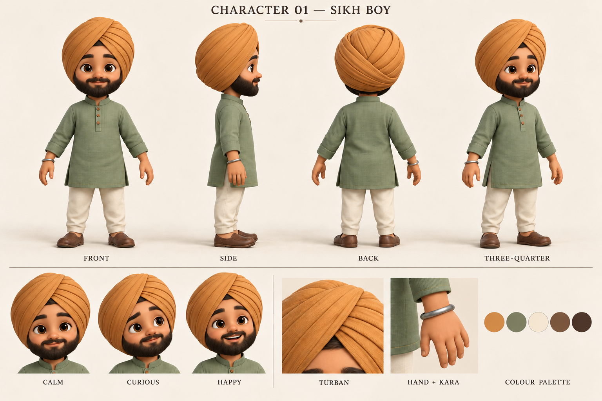

# Sikh boy — character reference v2

Version 2 is the current reference: a rounded full beard and moustache, with both ears completely covered by the turban in every view. Version 1 is retained for history.

## Intended use

This sheet establishes the character before implementing him in the portfolio. The user has specified separate stationary instances at different structures instead of a character traveling along the path. Placement, poses per structure, and code changes belong to the later implementation phase.

## Identity and silhouette

- A cute stylized Sikh boy with warm brown skin, rounded cheeks, expressive dark eyes, defined eyebrows, a small nose, a rounded dark beard and moustache, and a gentle smile.
- Compact saffron turban with layered diagonal folds and a clear front convergence. Its lower side wraps fully cover both ears; no visible ears or lobes. Preserve its wrapped silhouette in every view.
- Sage/jade kurta with a standing collar, short button placket, cuffs and side slits; ivory trousers and brown slip-on shoes.
- Steel kara on the character's right wrist. Keep the same wrist across mirrored views and posed instances.
- A slightly oversized head with a fully formed torso and separate articulated arms and legs. Preserve elbows, wrists, knees, ankles, hands, thumbs and shoes.

## Modeling guidance

The sheet is the visual reference; its proportions take precedence over the approximate proportions in the generation prompt. Simplify fabric weave and tiny creases for the small on-screen 3D model. Prioritize turban folds, face, clothing silhouette and limb separation. Arms must remain distinguishable from the torso, and the two legs must remain readable from the portfolio's elevated isometric camera.

Use the front, side, back and three-quarter views together. Expressions cover calm, curious and happy. Future instances should share one underlying character design and materials, with individually authored stationary poses. Retain the same clothing colors in both page themes; adapt scene lighting.

## Generation provenance

Created and edited with the built-in image generation tool. The original generation prompt is saved in [sikh-boy-character-sheet-v1.prompt.txt](./sikh-boy-character-sheet-v1.prompt.txt); the current edit prompt is saved in [sikh-boy-character-sheet-v2.prompt.txt](./sikh-boy-character-sheet-v2.prompt.txt).
